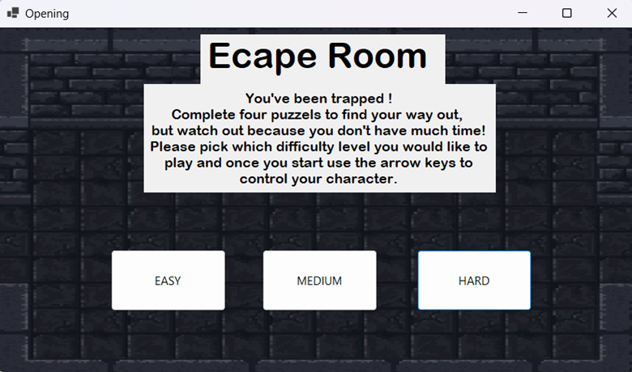
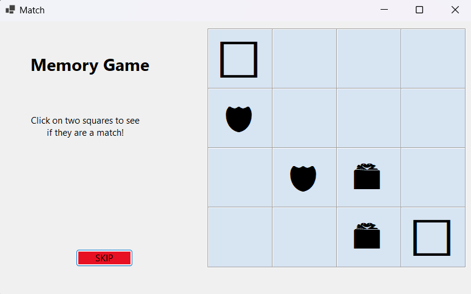
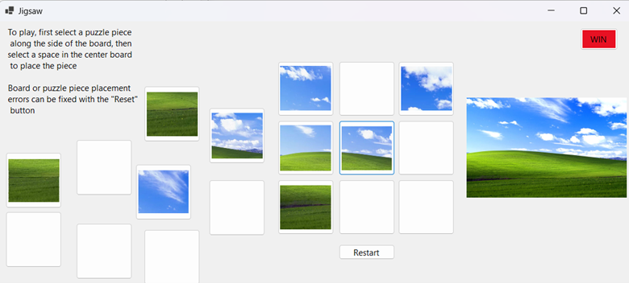
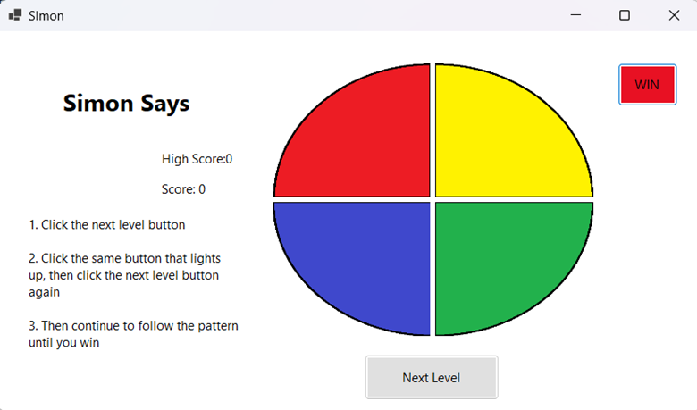
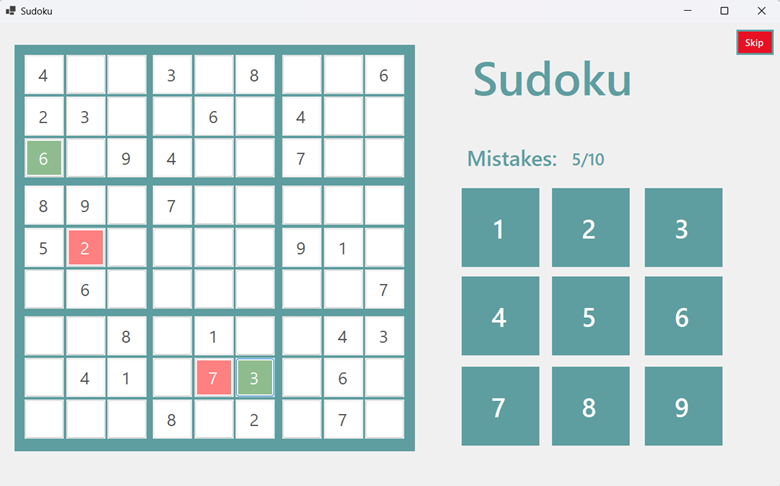

# Escape-Arcade

A collection of 4 classic arcade games built with C# and Windows Forms. Developed by a team of undergraduates using Agile Scrum, this project focuses on game logic, user interactions, and clean code. The game provides an immersive arcade-style escape room experience with a variety of challenges and interactions.

## Features

- 4 classic arcade games built with C# and Windows Forms.
- Agile Scrum development methodology used by a team of 4 undergraduates.
- Clean, modular codebase with a focus on user experience and interaction.
- Immersive arcade-style escape room gameplay.

## Games Included

1. **Matching Game** - A memory game where players match pairs of cards based on their images.
2. **Jigsaw Puzzle** - A puzzle game where players piece together a jigsaw to form a complete image.
3. **Simon Says** - A game that tests memory and attention by repeating a sequence of colors and requiring the player to match the sequence.
4. **Sudoku** - A number-based puzzle game that challenges players to fill a 9x9 grid following Sudoku rules.

### Starting Page


### Matching Game


### Jigsaw Puzzle


### Simon Says


### Sudoku


## Getting Started

1. Clone this repository to your local machine:
   ```bash
   git clone https://github.com/Adri-ayala/Escape-Arcade.git
   ```
2. Open the project in Visual Studio.
3. Build and run the project to play the arcade games.

## Technologies Used

- C#  
- Windows Forms  
- Agile Scrum (team collaboration)

## License

This project is licensed under the MIT License - see the [LICENSE](LICENSE) file for details.
